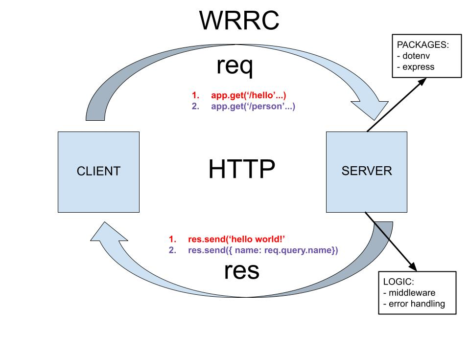

# Lab 02 - 401 JavaScript

# Basic Express Server

## Author: Lydia Minehan-Tubic

### Links and Resources

✨ [Deployed Heroku Site](https://lydia-basic-express-server.herokuapp.com/)

✨ [Deployed Heroku Site](https://lydia-basic-express-server.herokuapp.com/hello) - `/hello` route

✨ [Deployed Heroku Site](https://lydia-basic-express-server.herokuapp.com/person?name=potato) - `/person` route with sample name query

✨ [GitHub Actions](https://github.com/LydiaMT/basic-express-server/actions)

✨ [Pull Request](https://github.com/LydiaMT/basic-express-server/pull/2)


### Setup

- Clone down to your device
- In the root directory, run `npm install` to install node modules
- Create a `.env` file and add a port variable to your environment
- Run `nodemon` to see your live server via local host in your browser. On the `'/hello'` route you should see 'hello world!'

### Test

In the command line at the root directory, `run npm test` to make sure all test are passing as expected. There are three test Suites and 6 total tests

### Architecture

```git
├── .gitignore
├── .eslintrc.json
├── __tests__
│   ├── server.test.js
│   ├── validator.test.js
│   ├── logger.test.js
├── src
│   ├── error-handlers
│   │   ├── 404.js
│   │   ├── 500.js
│   ├── middleware
│   │   ├── logger.js
│   │   ├── validator.js
│   ├── server.js
├── index.js
└── package.json
```

### UML / WRRC


